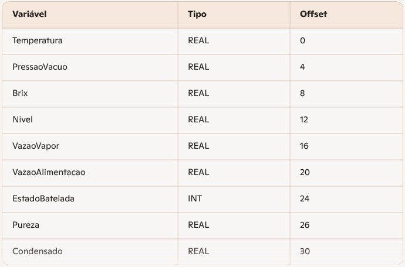

### 📘 Serviço Edge de Coleta de Dados Industriais (Snap7 → SQL Server)

#### 🏭 Visão Geral
O serviço Edge Cozedores é responsável por realizar a coleta contínua de dados dos 10 Cozedores da usina, conectados ao CLP Siemens S7‑315‑2 PN/DP via S7 Protocol (Snap7), e armazenar os dados brutos diretamente no SQL Server (camada RAW).

Ele roda em um ambiente Edge Computing, containerizado com Docker, garantindo:
- baixa latência
- resiliência
- isolamento
- escalabilidade
- segurança
- independência da rede corporativa


#### 🔌 Arquitetura do Serviço
**ET 200M** → *Profibus DP* → **S7‑315-2 PN/DP** → *Profinet* → Snap7 Reader (Docker/Edge) → SQL Server (RAW)


O Edge executa:
- leitura dos DBs estruturados (DB101–DB205)
- conversão de bytes → valores industriais
- logs estruturados em JSON
- inserção no SQL Server
- reconexão automática
- operação contínua 24/7


#### 📦 Componentes do Serviço:

**1. snap7_reader.py**

Script principal que:
- conecta ao CLP via Snap7
- lê os DBs dos cozedores
- converte REAL/INT/BOOL
- gera logs estruturados
- grava no SQL Server

**2. Dockerfile**

Define o container do serviço Edge.


**3. docker-compose.yml**

Orquestra:
- o serviço Snap7 Reader
- o SQL Server


#### 🧱 Estrutura dos DBs no CLP

Cada cozedor possui um DB exclusivo:
````
DB101 – Cozedor 01
DB102 – Cozedor 02
...
DB105 – Cozedor 05
DB201 – Cozedor 06
...
DB205 – Cozedor 10
````
Cada DB possui a seguinte estrutura (34 bytes):

 


#### 🗄️ Modelagem RAW no SQL Server

Tabela utilizada pelo serviço:
````
raw_cozedores (
    id BIGINT IDENTITY PRIMARY KEY,
    timestamp_utc DATETIME2,
    fluxo INT,
    cozedor INT,
    temperatura FLOAT,
    pressao_vacuo FLOAT,
    brix FLOAT,
    nivel FLOAT,
    vazao_vapor FLOAT,
    vazao_alimentacao FLOAT,
    estado_batelada INT,
    pureza FLOAT,
    condensado FLOAT,
    recebido_em DATETIME2 DEFAULT SYSUTCDATETIME()
)
````

#### 📊 Logs Estruturados (JSON)
Todos os logs seguem o formato:
````
{
  "timestamp": "2026-04-02T23:15:00Z",
  "level": "info",
  "message": "Registro inserido",
  "extra": {
    "cozedor": 3,
    "temperatura": 67.2,
    "brix": 88.5
  }
}
````
Benefícios:
- rastreabilidade total
- auditoria industrial


#### 🔄 Reconexão Automática
O serviço:
- detecta perda de conexão
- tenta reconectar a cada 5 segundos
- registra falhas em JSON
- nunca interrompe o ciclo de coleta


#### 🛡️ Boas Práticas de Produção
- rodar o Edge em hardware industrial (IPC, gateway Rugged)
- rede dedicada entre Edge ↔ CLP
- SQL Server em DMZ
- logs enviados para servidor central
- Airflow orquestrando ETLs


#### 🏁 Conclusão:
O serviço Edge é o coração da coleta de dados industriais dos Cozedores.
Ele garante:
- confiabilidade
- rastreabilidade
- segurança
- escalabilidade
- integração TO/TI real

E serve como base para:
- ETLs (Airflow)
- KPIs
- dashboards
- análises avançadas
- digital twins
