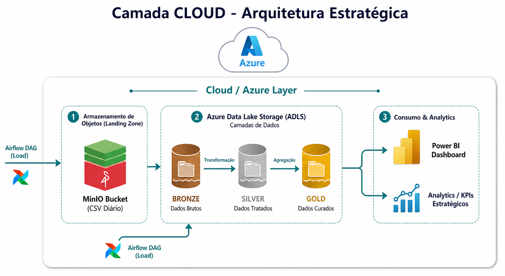

# Arquitetura Cloud — Camada Estratégica

Documentação técnica da camada Cloud do projeto de Engenharia de Dados Industrial aplicado aos **Cozedores** de uma usina sucroenergética.

Esta camada é responsável pela integração dos dados tratados no ambiente On-Premises com uma arquitetura analítica em nuvem, baseada no padrão **Medallion Architecture**: Bronze, Silver e Gold.

---

## 📊 Diagrama da Arquitetura Cloud



---

## 🎯 Objetivo

A camada Cloud tem como objetivo consolidar, organizar, historizar e disponibilizar os dados industriais dos cozedores para análises estratégicas de gestão.

Enquanto a camada **On-Premises** atende decisões operacionais da produção, a camada **Cloud** atende decisões corporativas, gerenciais e analíticas.

---

## 🧠 Visão Geral

O fluxo Cloud inicia-se a partir dos dados já tratados na camada **CURATED** do SQL Server On-Premises.

A partir dessa camada, uma DAG no Apache Airflow realiza:

1. Extração dos dados particionados por dia
2. Conversão dos dados para arquivos `.CSV`
3. Armazenamento intermediário em um bucket no **MinIO**
4. Posterior carga dos arquivos para a camada **BRONZE** do **Azure Data Lake Storage**
5. Transformações para as camadas **SILVER** e **GOLD**
6. Consumo analítico via **Power BI**

---

## 🔄 Fluxo Geral da Camada Cloud

```text
SQL Server CURATED
        │
        │ DAG Airflow - Export CSV
        ▼
MinIO Bucket
        │
        │ DAG Airflow - Load to ADLS
        ▼
ADLS BRONZE
        │
        │ Tratamento e Padronização
        ▼
ADLS SILVER
        │
        │ Agregação e Particionamento
        ▼
ADLS GOLD
        │
        │ Consumo Analítico
        ▼
Power BI
```
---

### 🧩 Papel da Camada Cloud na Arquitetura Híbrida
A arquitetura do projeto é híbrida porque combina:

|   Ambiente  |	                 Papel	                           | Decisão Apoiada |
|-------------|----------------------------------------------------|-----------------|
| On-Premises |	Aquisição, tratamento inicial e apoio operacional	 | Produção        |
| Cloud       |	Historização, consolidação e análises estratégicas | Gestão          |

A camada Cloud recebe dados industriais já tratados localmente e os transforma em ativos analíticos para acompanhamento estratégico da performance dos cozedores.

---

### 1. Origem dos Dados — SQL Server CURATED
A camada CURATED do SQL Server contém dados tratados, normalizados e validados no ambiente On-Premises.

Essa camada é utilizada como fonte para exportação diária dos dados para a nuvem.

#### Características da camada CURATED
- Dados limpos e estruturados
- Variáveis padronizadas
- Tipos de dados corrigidos
- Particionamento lógico por data
- Identificação por cozedor
- Pronta para consumo por pipelines analíticos

---

### 2. Exportação CSV via Apache Airflow
A primeira etapa da integração Cloud é realizada por uma DAG no Apache Airflow responsável por extrair os dados da camada CURATED.

#### Responsabilidades da DAG
- Conectar ao SQL Server On-Premises
- Consultar dados particionados por dia
- Exportar os dados para arquivo .CSV
- Aplicar padronização de nome do arquivo
- Registrar logs da execução
- Gravar o arquivo no bucket MinIO

#### Exemplo de estrutura de diretórios no MinIO
````
minio://cozedores-curated/
└── ano=2026/
    └── mes=06/
        └── dia=24/
            └── cozedores_curated_2026-06-24.csv
````
#### Essa organização facilita:
- Reprocessamento por data
- Auditoria
- Rastreabilidade
- Cargas incrementais
- Particionamento futuro no Data Lake

---

### 3. MinIO — Staging Object Storage
O MinIO atua como uma camada intermediária de armazenamento entre o ambiente On-Premises e a Nuvem.

#### Papel do MinIO
- Receber os arquivos .CSV gerados pelo Airflow
- Servir como staging area
- Desacoplar o ambiente On-Premises da ingestão Cloud
- Garantir resiliência em caso de indisponibilidade temporária de conexão com a nuvem

#### Benefícios arquiteturais
|  Benefício	  | Descrição                                                            |
|-----------------|----------------------------------------------------------------------|
| Desacoplamento  | O processo local não depende diretamente da disponibilidade da nuvem |
| Resiliência	  | Arquivos podem ser reenviados posteriormente                         |
| Auditoria	  | Os CSVs permanecem armazenados para conferência                      |
| Reprocessamento | Permite recarregar dados por período                                 |
| Simplicidade	  | Interface compatível com S3                                          |

---

### 4. Carga para ADLS — Azure Data Lake Storage
Após o armazenamento no MinIO, uma segunda DAG do Apache Airflow realiza a carga dos arquivos para o Azure Data Lake Storage (ADLS).

#### Responsabilidades da DAG
- Monitorar arquivos disponíveis no MinIO
- Validar existência e integridade dos arquivos
- Carregar os arquivos para a camada BRONZE do ADLS
- Organizar os dados por partição
- Registrar metadados da carga
- Evitar duplicidade de ingestão

---

### 5. Arquitetura Medallion
A arquitetura Cloud segue o padrão Medallion Architecture, dividido em três camadas:

**BRONZE → SILVER → GOLD**

Cada camada representa um avanço na qualidade, estruturação e valor analítico dos dados.

#### 5.1 Camada BRONZE
A camada BRONZE recebe os dados vindos do MinIO com mínima transformação.

#### Objetivo
Preservar o dado ingerido, mantendo rastreabilidade e possibilidade de reprocessamento.

#### Características
- Dados brutos ou semi-tratados
- Estrutura próxima ao arquivo de origem
- Armazenamento particionado por data
- Preservação do histórico de cargas
- Controle de ingestão

#### Exemplo de dados
| timestamp_processo  |	cozedor_id |  tag   | valor | unidade |
|---------------------|------------|--------|-------|---------|
| 2026-06-24 10:15:00 |	    1	   | TT_101 | 86.4  |	°C    |
| 2026-06-24 10:15:00 |	    2	   | PT_102 | 1.25  |	bar   |
| 2026-06-24 10:15:00 |     3	   | LT_103 | 72.8  |	%     |

#### 5.2 Camada SILVER
A camada SILVER representa os dados tratados, padronizados e enriquecidos.

#### Objetivo
Produzir uma base confiável para análises, integrando regras de qualidade e padronização.

#### Transformações típicas
- Conversão de tipos
- Tratamento de nulos
- Padronização de nomes de colunas
- Validação de faixa operacional
- Remoção ou marcação de outliers
- Enriquecimento com metadados do processo
- Padronização de unidades de engenharia

#### Exemplo de regras de qualidade
|           Regra	   |              Aplicação                 |
|--------------------------|----------------------------------------|
| Temperatura não negativa | Descarta ou sinaliza valores inválidos |
| Timestamp obrigatório	   | Rejeita registros sem data/hora        |
| Cozedor obrigatório	   | Rejeita registros sem identificação    |
| Unidade padronizada	   | Converte ou normaliza unidades         |

#### 5.3 Camada GOLD
A camada GOLD contém os dados agregados e modelados para consumo analítico.

#### Objetivo
Disponibilizar indicadores e agregações para acompanhamento estratégico da gestão.

#### Características
- Dados agregados por período
- Particionamento por data, safra ou unidade produtiva
- Cálculo de KPIs
- Modelagem orientada ao consumo
- Integração com Power BI
  
#### Exemplos de agregações
|       Agregação	|             Descrição                   |
|-----------------------|-----------------------------------------|
| Produção por dia      | Consolidação diária por cozedor         |
| Média de temperatura  | Média operacional por ciclo             |
| Consumo de vapor      | Volume consolidado por período          |
| Eficiência do cozedor | Indicador de performance do equipamento |
| Pureza média          | Indicador de qualidade do processo      |

---

### 6. KPIs Estratégicos
Os dados da camada GOLD apoiam o acompanhamento de indicadores estratégicos.

#### Exemplos de KPIs
|          KPI	              |                 Descrição                   |
|-----------------------------|---------------------------------------------|
| Eficiência média            |	Avalia o desempenho operacional consolidado |
| Consumo específico de vapor | Mede eficiência energética do processo      |
| Tempo médio de ciclo	      | Avalia produtividade dos cozedores          |
| Variação de pureza	      | Mede estabilidade da qualidade              |
| Disponibilidade operacional |	Mede tempo útil do equipamento              |
| Desvios operacionais	      | Quantifica eventos fora da faixa ideal      |

---

### 7. Consumo Analítico — Power BI
O Power BI consome os dados consolidados da camada GOLD para disponibilizar dashboards estratégicos.

#### Exemplos de visões
- Performance diária dos cozedores
- Tendência histórica de eficiência
- Comparativo entre cozedores
- Consumo de vapor por período
- Indicadores por safra
- Análise de desvios operacionais
- Evolução da pureza
  
#### Público-alvo
|        Público	  |                    Uso                       |
|-------------------------|----------------------------------------------|
| Gestão Industrial	  | Acompanhamento de eficiência e produtividade |
| Supervisão de Produção  | Análise histórica e comparação de turnos     |
| Engenharia de Processos | Otimização e investigação de desvios         |
| Manutenção	          | Identificação de comportamento anômalo       |
| Diretoria	          | Indicadores consolidados de performance      |

---

### 8. Vantagens da Arquitetura Cloud
|     Vantagem	    |               Impacto                       |
|-------------------|---------------------------------------------|
| Historização	    | Permite análise por safra e períodos longos |
| Escalabilidade    | Suporta crescimento do volume de dados      |
| Baixo acoplamento | MinIO desacopla ambiente local e nuvem      |
| Rastreabilidade   | Dados organizados por camada e partição     |
| Consumo analítico | Power BI acessa dados prontos para decisão  |
| Reprocessamento   | Possibilidade de reconstruir Silver e Gold  |
