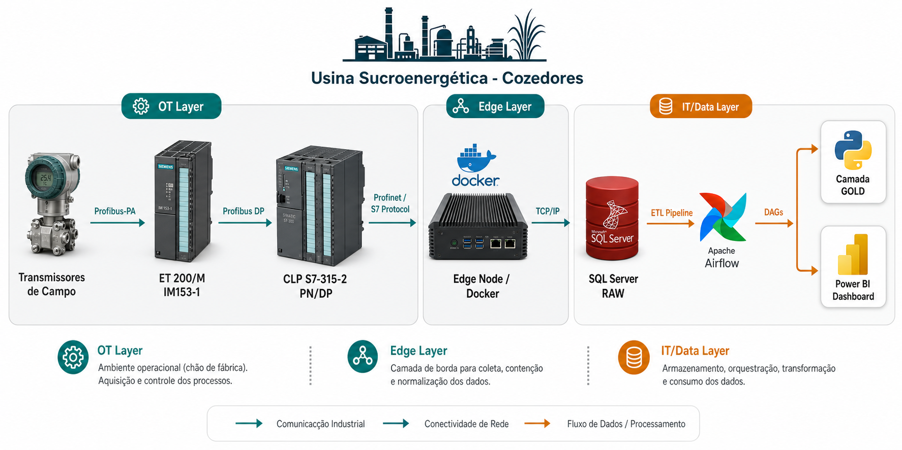

# Arquitetura On-Premises — Camada Operacional

Documentação técnica detalhada da camada local (On-Premises) do pipeline de engenharia de dados industriais aplicado aos **Cozedores** de uma usina sucroenergética.

---

## 📊 Diagrama da Arquitetura On-Premises



---

## 🎯 Objetivo

Garantir a **aquisição contínua, estruturação e disponibilização** dos dados de processo dos cozedores para suporte às decisões operacionais da produção, com dados confiáveis, rastreáveis e organizados.

---

## 🧱 Visão Geral das Camadas
````
[Instrumentos de Campo] │ Profibus-PA
[ET 200/M IM153-1]      │ Profibus DP
[CLP S7-315-2 PN/DP]    │ Profinet / S7 Protocol
[Edge Node Docker]      │ TCP/IP
[SQL Server - RAW]      │ ETL Pipeline
[Apache Airflow]        │ DAGs
````

---

## 🏭 1. Camada OT (Operational Technology)

### 1.1 Instrumentos de Campo

Os **transmissores** são responsáveis pela medição contínua das variáveis de processo dos cozedores:

|  Variável   |    Tipo de Instrumento     |
|-------------|----------------------------|
| Pressão     | Transmissor de pressão     |
| Temperatura | Transmissor de temperatura |
| Nível       | Transmissor de nível       |
| Fluxo       | Medidor de vazão           |

- **Protocolo de comunicação:** Profibus-PA
- **Função:** Mensurar e transmitir variáveis analógicas do processo

---

### 1.2 Remota Siemens ET 200/M (IM153-1)

A **ET 200/M** funciona como módulo de I/O remoto distribuído.

- **Função:** Concentrar os sinais dos transmissores de campo
- **Protocolo de entrada:** Profibus-PA (instrumentos)
- **Protocolo de saída:** Profibus DP (para o CLP)
- **Modelo:** IM153-1

---

### 1.3 CLP Siemens S7-315-2 PN/DP

O **Controlador Lógico Programável (CLP)** é o núcleo de processamento da automação local.

- **Modelo:** Siemens S7-315-2 PN/DP
- **Função:** Executar lógicas de controle e organizar os dados em blocos estruturados
- **Estrutura de dados:** DBs organizados por Cozedor (DB101 a DB205)
- **Interface de rede:** Profinet (Industrial Ethernet)

#### Organização dos Blocos de Dados (DBs):
````
| Bloco | Conteúdo |
|-------|----------|
| DB101 | Cozedor 1 — variáveis de processo |
| DB102 | Cozedor 2 — variáveis de processo |
|  ...  |    ...   |
| DB205 | Cozedor 10 — variáveis de processo |
````
---

## 🖥️ 2. Camada Edge Computing

### 2.1 Edge Node (PC Industrial / Gateway)

O **Edge Node** é o ponto de tradução entre o mundo OT (automação) e o mundo IT (dados).

- **Tecnologia:** Docker (containers isolados e gerenciáveis)
- **Protocolo de entrada:** Profinet / S7 Protocol (PUT/GET)
- **Protocolo de saída:** TCP/IP → SQL Server

---

### 2.2 Containers Docker

#### 🐳 `snap7_reader`
Container principal de aquisição de dados.

**Responsabilidades:**
- Conectar ao CLP via S7 Protocol (biblioteca `python-snap7`)
- Ler os Blocos de Dados (DBs) de cada Cozedor ciclicamente
- Converter bytes brutos → tipos estruturados (`REAL`, `INT`, `BOOL`)
- Gerar payload estruturado (JSON / SQL INSERT)
- Enviar dados para o SQL Server (camada RAW)

**Exemplo de conversão de tipos:**
```python
# Leitura de variável REAL do DB101 offset 0
temperatura = snap7.util.get_real(data, 0)

# Leitura de variável INT do DB101 offset 4
nivel = snap7.util.get_int(data, 4)

# Leitura de variável BOOL do DB101 offset 8 bit 0
valvula_aberta = snap7.util.get_bool(data, 8, 0)
````

#### 🐳 `logger`
Container de rastreabilidade operacional.

**Responsabilidades:**
- Registrar falhas de comunicação
- Monitorar reconexões ao CLP
- Registrar tempos de ciclo de leitura
- Gerar logs estruturados para auditoria
  
#### 🐳 `healthcheck`
Container de monitoramento de saúde do pipeline.

**Responsabilidades:**
- Monitorar latência de comunicação com o CLP
- Verificar disponibilidade do S7-315
- Alertar em caso de timeout ou perda de conexão
  
---

 ### 🗄️ 3. Camada SQL Server (On-Premises)
 
#### 3.1 Esquema RAW
Armazena os dados brutos coletados diretamente do CLP, sem transformações.


|   Tabela	   |  Descrição                              |
|--------------|-----------------------------------------|
|raw_cozedores |Dados tabulares estruturados por cozedor |

- Objetivo: Garantir rastreabilidade e reprocessamento
- Política: Dados nunca são deletados da camada RAW
- Escopo: 10 cozedores monitorados
  
#### 3.2 Esquema CURATED
Dados tratados, normalizados e validados.

- Origem: ETL a partir do esquema RAW
- Transformações aplicadas:
  - Limpeza de nulos e outliers
  - Normalização de unidades de engenharia
  - Tipagem correta das variáveis
  - Particionamento por data e cozedor

#### 3.3 Esquema GOLD (On-Premises)
Dados agregados com KPIs calculados para consumo operacional.

|      KPI         |      Descrição                        |
|------------------|---------------------------------------|
| Eficiência	     | Rendimento do processo de cozimento   |
| Pureza do Caldo  | Índice de qualidade do produto        |
| Consumo de Vapor | Volume de vapor consumido por cozedor |
| Tempo de Ciclo   | Duração de cada ciclo de cozimento    |

---

### ⚙️ 4. Orquestração — Apache Airflow
O Airflow é responsável por orquestrar todos os pipelines de dados On-Premises.

#### DAGs implementadas:

|        DAG	         |              Descrição	                    |  Frequência  |
|----------------------|--------------------------------------------|--------------|
| etl_raw_to_curated	 | Limpeza e normalização dos dados brutos    | A cada ciclo |
| etl_curated_to_gold	 | Agregação e cálculo de KPIs	              | Diário       |
| export_curated_minio | Armazena os dados em formato csv no MinIO  | Diário       |

---

### 📡 5. Protocolos de Comunicação

|         Trecho	       |       Protocolo	     |              Descrição                  |
|------------------------|-----------------------|-----------------------------------------|
| Transmissores → ET200M | Profibus-PA	         | Comunicação em campo (instrumentação)   |
| ET200M → S7-315        | Profibus DP           | Backplane industrial de alta velocidade |
| S7-315 → Edge Node     | Profinet / S7 PUT/GET | Rede industrial Ethernet                |
| Edge Node → SQL Server | TCP/IP                | Rede corporativa / DMZ                  |

---

### 🔒 6. Segurança e Resiliência
- Isolamento de rede: A rede OT (Profibus/Profinet) é fisicamente separada da rede corporativa
- DMZ: O Edge Node atua como zona desmilitarizada entre OT e TI
- Reconexão automática: O snap7_reader implementa retry automático em caso de falha de comunicação
- Rastreabilidade: Toda leitura é registrada em raw_cozedores_json com timestamp
  
