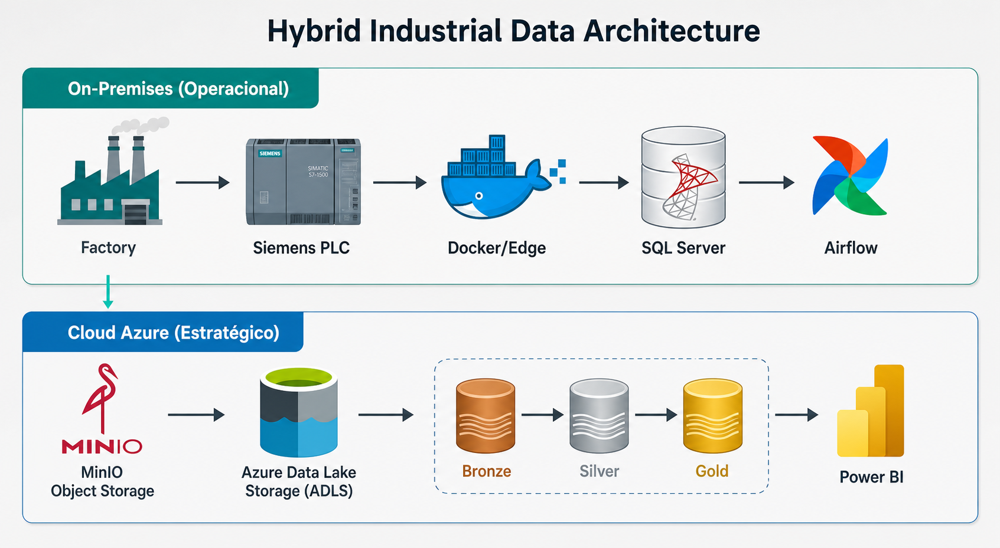

## Pipelines de Dados — Cozedores

Documentação técnica dos pipelines de dados do projeto de Engenharia de Dados Industrial aplicado aos **Cozedores** de uma usina sucroenergética.

Este documento descreve os fluxos de aquisição, tratamento, orquestração, integração Cloud, transformação e consumo analítico dos dados industriais.

---

### 📊 Diagrama Geral dos Pipelines



---

### 🎯 Objetivo

O objetivo dos pipelines é garantir que os dados de processo dos cozedores sejam:

- Coletados de forma contínua
- Persistidos com rastreabilidade
- Tratados e normalizados
- Disponibilizados para operação local
- Exportados para a nuvem
- Transformados em indicadores estratégicos
- Consumidos em dashboards gerenciais

---

### 🧠 Visão Geral dos Fluxos

O projeto possui dois grandes grupos de pipelines:

|          Grupo         |  Ambiente   |    Finalidade    |
|------------------------|-------------|------------------|
| Pipelines Operacionais | On-Premises | Apoio à produção |
| Pipelines Estratégicos | Cloud       | Apoio à gestão   |

---

### 🔄 Fluxo Macro

```text
    Transmissores (Campo)
        ↓
    ET 200M (IM-153)
        ↓
    CLP Siemens S7-315 PN/DP
        ↓
    Edge Node Docker - (snap7_reader.py)
        ↓
    SQL Server RAW
        ↓
-- SQL Server CURATED
|       ↓
|  SQL Server GOLD (Operacional)
|       ↓
|  Dashboards Operacionais
|   
-> SQL Server CURATED
        ↓
    CSV Diário
        ↓
    MinIO Bucket
        ↓
    ADLS Bronze
        ↓
    ADLS Silver
        ↓
    ADLS Gold
        ↓
    Power BI
```

---

### 1. Pipeline de Aquisição — snap7_reader.py
O pipeline de aquisição é responsável por coletar os dados diretamente do CLP Siemens S7-315 PN/DP, por meio do protocolo S7.

#### Responsabilidades
- Conectar ao CLP Siemens
- Ler os blocos de dados dos cozedores
- Interpretar os bytes brutos
- Converter os dados para tipos estruturados
- Enviar os registros para o SQL Server
- Registrar logs de execução e falhas

**Entrada**
|         Origem	         |               Descrição                     |
|--------------------------|---------------------------------------------|
| CLP Siemens S7-315 PN/DP | Blocos de dados com variáveis dos cozedores |

**Saída**
|    Destino	  |                 Descrição                      |
|---------------|------------------------------------------------|
|SQL Server RAW |	Dados brutos estruturados para rastreabilidade |

**Exemplo de fluxo interno**
````
Conectar ao CLP
    ↓
Ler DBs configurados
    ↓
Converter bytes para tipos reais
    ↓
Montar payload
    ↓
Inserir no SQL Server RAW
    ↓
Registrar status da coleta
````
---

### 2. Camada RAW — SQL Server
A camada RAW armazena os dados provenientes diretamente do snap7_reader.py.

Objetivo
Preservar os dados originais coletados do processo industrial, garantindo rastreabilidade e possibilidade de reprocessamento.

#### Características
- Dados com mínima transformação
- Registro de timestamp de coleta
- Identificação do cozedor
- Identificação da tag
- Valor bruto/interpretado
- Armazenamento histórico
- Base para reprocessamento

---

### 3. Pipeline RAW → CURATED
Este pipeline trata os dados brutos da camada RAW e gera uma base confiável para consumo operacional e analítico.

**DAG ->** *etl_raw_to_curated*

#### Responsabilidades
- Ler dados novos da camada RAW
- Validar estrutura dos registros
- Remover duplicidades
- Tratar valores nulos
- Padronizar nomes de tags
- Padronizar unidades de engenharia
- Identificar valores fora da faixa esperada
- Criar indicadores de qualidade do dado
- Gravar os dados na camada CURATED
  
|     Entrada    |       Saída        |
|----------------|--------------------|
| SQL Server RAW | SQL Server CURATED |

**Transformações típicas**
|    Transformação   	 |              Descrição                         |
|----------------------|------------------------------------------------|
| Deduplicação         |	Remove registros repetidos                    |
| Conversão de tipos   |	Garante tipos numéricos e temporais corretos  |
| Validação de faixa   |	Identifica valores fora do limite operacional |
| Normalização de tags |	Padroniza nomenclaturas                       |
| Enriquecimento       |	Adiciona metadados de cozedor e área          |
